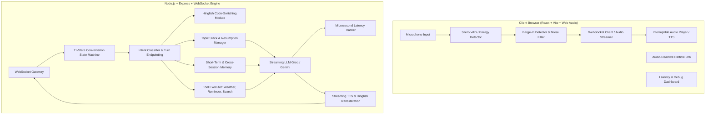

# Truly Human-Like Real-Time Voice Agent (Ayra)

A production-quality **real-time voice agent** engineered to simulate authentic human conversation dynamics. Rather than behaving like a turn-based chatbot, Ayra features **instant barge-in with acoustic noise discrimination, natural pause-cue backchanneling, incomplete-thought turn endpointing, first-class Hinglish code-switching, agentic tool execution with conversational in-flight fillers, explicit topic stack tracking with resumption, cross-session long-term memory, and an engineering-grade live latency dashboard.**

---

## 🌟 Key Highlights & Capabilities

### 1. Instant Barge-In & Interruption Robustness (Section 2 & 2a)
- **Instant Audio Cutoff**: Playback, streaming synthesis, and in-flight token buffers are cancelled immediately (`stopAudioPlayback()`, `cancelCurrentTTS()`) upon user speech.
- **Noise vs. Speech Discrimination**: Operates a confirmation window (~150–250ms) to distinguish real speech (>250ms with valid phonemes/tokens) from non-interruption transient noise (coughs, throat clears, solitary "uh"/"hmm", mic bumps).
- **Rejected Noise Logging**: Every noise event evaluated and ignored during agent speech is logged to the Live Latency & Debug Dashboard for inspection.

### 2. Natural Turn-Taking & Endpointing (Section 5)
- Intelligent VAD endpoint detection distinguishes complete sentences from incomplete trailing thoughts (*"I was thinking because..."* $\rightarrow$ holds turn for ~750ms; *"I was thinking about dinner tonight."* $\rightarrow$ triggers immediate ~350ms response).

### 3. Pause-Cue Backchanneling (Section 3)
- When the user speaks continuously for $>8-15\text{s}$, the agent utters lightweight acknowledgements (*"Hmm."*, *"Yeah."*, *"Haan."*, *"Achha."*, *"Sahi hai."*) on natural pause cues without interrupting or taking over the turn.

### 4. First-Class Hinglish Code-Switching (Section 2)
- Seamlessly switches between Hindi and English mid-sentence based on how the user speaks (*"Yaar main aaj kaafi tired hoon, project deadline kal subah hai"* $\rightarrow$ mirrors natural Romanized Hinglish).
- Applies phonetic transliteration normalization to ensure crisp pronunciation across TTS engines.

### 5. Agentic Tools with Conversational In-Flight Fillers (Section 6)
- Callable tools: `get_weather(city)`, `set_reminder(text, time)`, `search_fact(query)`.
- **Zero Dead Air**: Emits an immediate natural spoken filler (*"Gimme a sec, checking that..."*, *"Ek second, dekh ke batati hoon..."*) while the tool executes asynchronously, then folds the result organically into speech.

### 6. Explicit Topic Stack & Resumption (Section 7 & 8)
- Maintains an explicit stack of suspended topics. When conversation shifts (*Topic A* $\rightarrow$ *Topic B*), Topic A is pushed onto the stack. Resumption cues (*"Anyway, coming back to my project..."*) pop and restore context naturally.

### 7. Cross-Session Long-Term Memory (Section 8)
- Keyed by user/device ID, storing stable facts, career context, preferences, and reminders.
- Contextual recall re-surfaces remembered facts only when relevant (e.g. user mentions fatigue $\rightarrow$ agent organically relates it to prior interview preparation without robotic memory dumping).

### 8. Live Latency & Debug Dashboard (Section 26)
- Real-time gauge metrics for **STT Latency**, **LLM TTFT** (Time-to-First-Token), **TTS TTFA** (Time-to-First-Audio), and **Total Turn Latency** (Target: 300–1000ms).
- Live rolling average latency chart across the last 10 turns and real vs. rejected interruption logs.

---

## 🏛 Architecture Diagram



---

## ⚡ $0 Free Tech Stack Setup

All components are configured to run on free tiers with no credit card required:

| Component | Free Provider | Free Tier Allowance |
| :--- | :--- | :--- |
| **STT** | Groq API (`whisper-large-v3-turbo`) | ~30 req/min, 14,400 req/day (Free) |
| **STT Fallback** | Browser Web Speech API (`SpeechRecognition`) | 100% Free & Local in browser |
| **LLM** | Groq API (`llama-3.3-70b-versatile` / `llama-3.1-8b-instant`) | Ultra-fast LPU inference (Free) |
| **LLM Fallback** | Google Gemini API (`gemini-1.5-flash`) | 1,500 req/day (Free) |
| **TTS** | Browser SpeechSynthesis / Web Audio API | Zero network latency (Free) |
| **TTS Upgrade** | ElevenLabs Multilingual (Optional API Key) | High-fidelity voice cloning |
| **VAD** | Web Audio API / RMS Energy & Speech Recognition | Client-side WASM & Web Audio (Free) |
| **Memory** | Local Persistent JSON (`data/memory.json`) / MongoDB Atlas | Free tier |

---

## 🚀 Quick Start & Local Run

### Prerequisites
- Node.js $\ge$ 18.0.0
- npm $\ge$ 9.0.0

### 1. Install Dependencies
```bash
npm run install:all
```

### 2. Configure Environment Variables
Copy `server/.env.example` to `server/.env`:
```bash
cp server/.env.example server/.env
```
*(Optional)* Add your free [Groq API Key](https://console.groq.com) or [Google Gemini API Key](https://aistudio.google.com). If left blank, the app runs in **Zero-Config Local Simulation Mode**.

### 3. Run Development Servers
Start both backend and frontend concurrently:
```bash
npm run dev
```
- **Frontend**: `http://localhost:5173`
- **Backend HTTP & WebSocket**: `http://localhost:3001` (WebSocket: `ws://localhost:3001/ws`)

### 4. Run Automated Scenario Test Suite
Verify all 10 master conversation scenarios:
```bash
npm run test:scenarios
```

---

## 🧪 10 Master Conversation Test Scenarios

The system includes an interactive test suite with one-click triggers directly in the UI and via automated CLI:

1. **Normal Conversational Exchange**: Casual greeting and turn-taking banter.
2. **Mid-Speech Barge-In (Interruption)**: User interrupts agent mid-thought $\rightarrow$ audio stops immediately, agent pivots cleanly.
3. **Noise Robustness (Cough vs. Real Speech)**: Non-speech cough during playback is ignored and logged; real words trigger immediate barge-in.
4. **Backchanneling Monologue**: User speaks for continuous $>8\text{s}$, agent utters natural pause-cue backchannels (*"Haan"*, *"Yeah"*).
5. **Topic Stack Push & Resumption**: Topic shifts (Project $\rightarrow$ Weather), then returns (*"Anyway, coming back to my project..."* $\rightarrow$ restores context).
6. **Hinglish Code-Switching**: Full mixed Hindi-English conversation with phonetic pronunciation.
7. **Tool Calling: Weather with In-Flight Filler**: *"What's the weather in Mumbai?"* $\rightarrow$ filler utterance + spoken weather report.
8. **Tool Calling: Set Reminder**: Schedules reminder into session and cross-session memory.
9. **Cross-Session Memory Recall**: User mentions fatigue in a new call $\rightarrow$ agent contextually references prior interview prep fact.
10. **Incomplete Thought Turn-Taking**: Trailing *"I was thinking because..."* holds turn; complete sentences trigger immediate reply.

---

## 🌐 Deployment Guide

### Deploy Frontend to Vercel
1. Set root directory to `client`.
2. Build command: `npm run build`.
3. Output directory: `dist`.

### Deploy Backend to Render / Railway
1. Set root directory to `server`.
2. Build command: `npm run build`.
3. Start command: `npm run start`.
4. Add environment variables (`GROQ_API_KEY`, `GEMINI_API_KEY`, `PORT=3001`).

---

## 📜 License
MIT License
