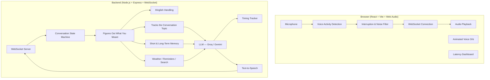

# Ayra — A Real-Time Voice Agent You Can Actually Talk To

Ayra is a voice agent built to feel like a real conversation, not a "press to talk, wait, get a reply" chatbot. You can interrupt it mid-sentence, it knows when you're just saying "hmm" versus actually asking something, it follows the conversation as you jump between topics, and it can switch naturally between Hindi and English the way people actually talk.

---

## What it can do

**You can interrupt it, and it actually stops.**
If Ayra is talking and you start speaking, it stops immediately — no finishing its sentence, no talking over you. It's also smart about telling the difference between you actually interrupting and just coughing or saying "hmm" while it talks — those get ignored so it doesn't stop for no reason. Every time this happens, it gets logged so you can see it working (see the dashboard below).

**It knows when you're done talking, not just when you pause.**
"I was thinking because..." and "I was thinking about dinner tonight." sound different to Ayra — the first one is clearly unfinished, so it waits instead of jumping in too early.

**It gives small "I'm listening" cues while you talk.**
If you're mid-story for a while, it'll drop in a quiet "hmm" or "yeah" here and there — like a person nodding along — without cutting you off or taking over.

**It speaks Hinglish naturally.**
If you talk to it in a Hindi-English mix, it replies the same way, instead of forcing everything into one language.

**It can actually do things, not just talk.**
It can check the weather, set a reminder, or look something up for you mid-conversation. While it's doing that, it says something like "gimme a sec, checking that" instead of going silent and making it feel stuck.

**It remembers what you were talking about.**
If you switch topics and come back later ("anyway, back to what I was saying about my project..."), it picks the thread back up instead of losing track.

**It remembers things across calls, too.**
If you mention something important in one call, it can bring it up naturally in a later one — without dumping everything it remembers on you at once.

**You can see exactly how fast it's responding.**
There's a live dashboard showing how long each part of the pipeline takes — understanding your speech, generating a reply, and turning it back into audio — so you're not just guessing whether it "feels fast."

---

## How it's put together



In short: your voice goes in, gets turned into text, the model figures out what you meant and generates a reply, and that reply gets turned back into audio — all streamed piece by piece so you're not waiting for the whole thing to finish before hearing anything.

---

## What it's built with — and it's all free to run

You don't need to pay for anything to try this. Everything below runs on a free tier, no credit card required.

| Part | What's used | Free tier |
| :--- | :--- | :--- |
| Speech-to-text | Groq (Whisper large-v3-turbo) | ~30 requests/min, 14,400/day |
| Speech-to-text (backup) | Browser's built-in speech recognition | Free, runs locally |
| Reply generation | Groq (Llama 3.3 70B / 3.1 8B) | Free, very fast |
| Reply generation (backup) | Google Gemini (1.5 Flash) | 1,500 requests/day |
| Text-to-speech | Browser's built-in speech synthesis | Free, no network delay |
| Text-to-speech (better quality) | ElevenLabs (optional, needs a key) | Higher-quality/cloned voice |
| Voice detection | Web Audio API | Free, runs in your browser |
| Memory | Local file, or MongoDB Atlas | Free tier |

---

## Running it yourself

### You'll need
- Node.js 18 or newer
- npm 9 or newer

### 1. Install everything
```bash
npm run install:all
```

### 2. Set up your environment file
```bash
cp server/.env.example server/.env
```
Add a free [Groq API key](https://console.groq.com) or [Gemini API key](https://aistudio.google.com) if you have one. If you skip this, it still runs — just in a simplified local mode without the real AI calls.

### 3. Start it up
```bash
npm run dev
```
- Frontend: `http://localhost:5173`
- Backend: `http://localhost:3001` (WebSocket at `ws://localhost:3001/ws`)

### 4. Run the test scenarios
```bash
npm run test:scenarios
```

---

## Things to try once it's running

1. **Just talk to it normally** — say hi, see how it responds.
2. **Interrupt it mid-sentence** — it should stop right away and follow what you just said.
3. **Cough or say "hmm" while it's talking** — it should keep going, not stop.
4. **Talk for a while without pausing** — listen for the small "hmm"/"yeah" check-ins.
5. **Switch topics, then come back to an earlier one** — "anyway, back to what I was saying..." and see if it remembers.
6. **Mix Hindi and English** — see if it replies in the same mix.
7. **Ask it to check the weather or set a reminder** — listen for the filler while it's working.
8. **Set a reminder, end the call, start a new one** — see if it remembers what you told it.
9. **Mention something personal, end the call, start a new one, bring it up again indirectly** — see if it connects the dots.
10. **Leave a sentence unfinished on purpose** ("I was thinking because...") — it should wait instead of jumping in.

---

## Putting it online

### Frontend → Vercel
- Root directory: `client`
- Build command: `npm run build`
- Output directory: `dist`

### Backend → Render or Railway
- Root directory: `server`
- Build command: `npm run build`
- Start command: `npm run start`
- Environment variables: `GROQ_API_KEY`, `GEMINI_API_KEY`, `PORT=3001`

---

## License
MIT
